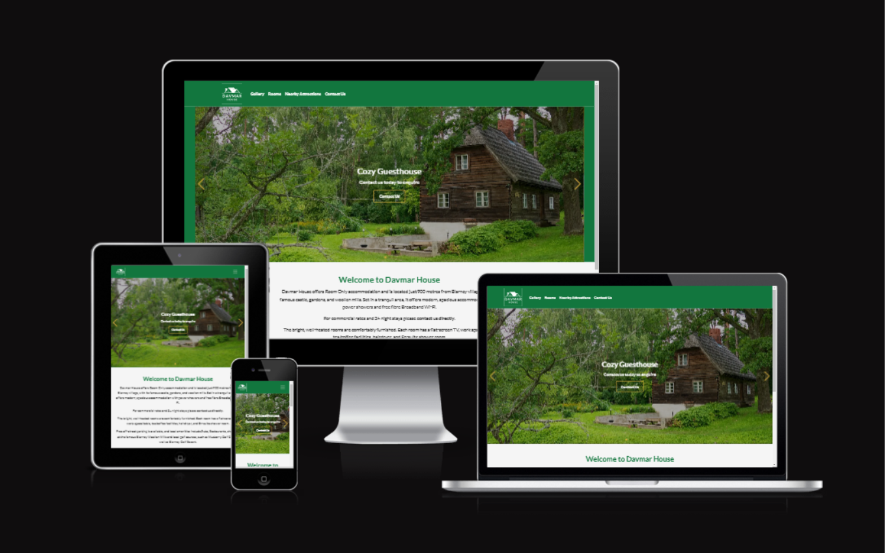
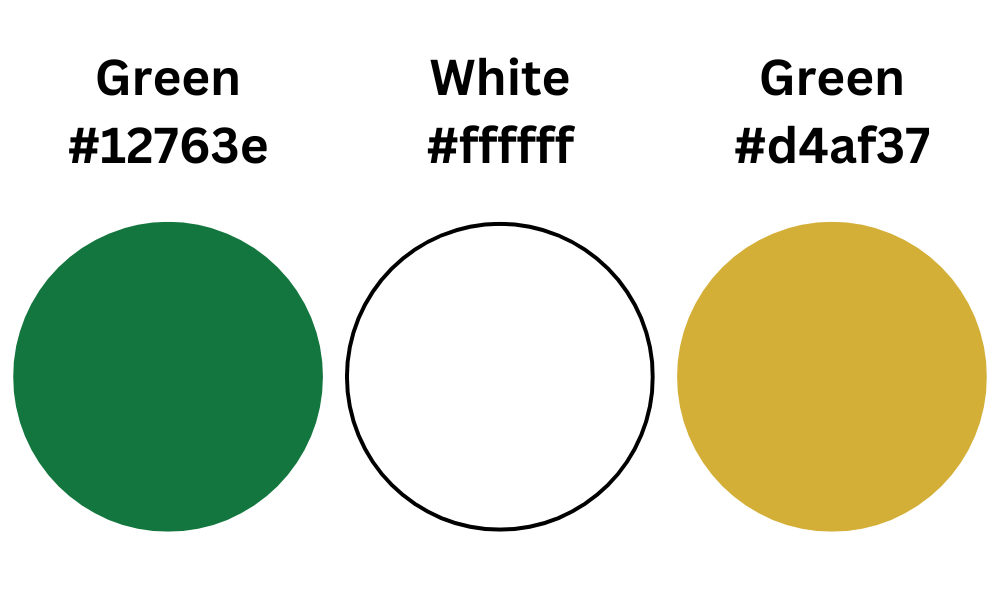
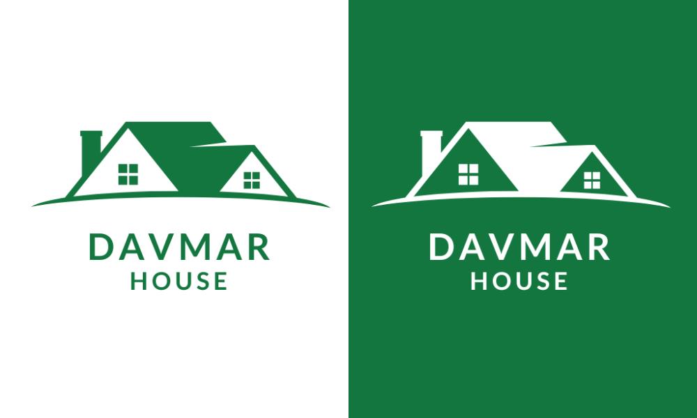
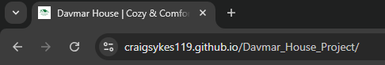
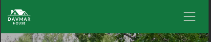
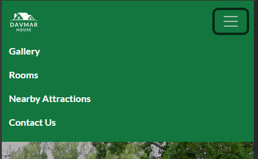
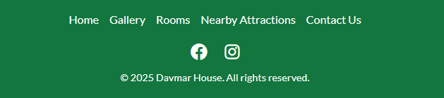
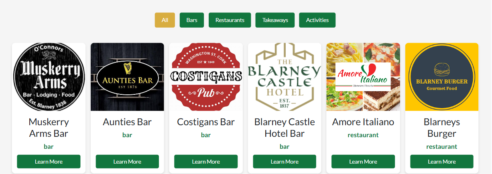
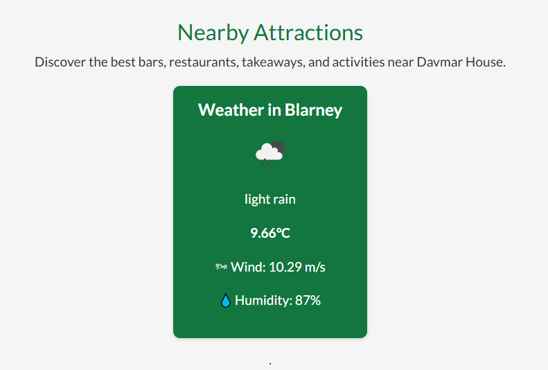

# Davmar House

The Davmar House website is designed to provide an engaging and informative online presence for a guesthouse located in Blarney, County Cork, Ireland. This website offers a seamless user experience, allowing visitors to explore the guesthouse, browse amenities, discover nearby attractions, and easily make contact for inquiries or bookings. View the live site [here](https://craigsykes119.github.io/Davmar_House_Project/).

 

GitHub Profile: <https://github.com/CraigSykes119>
Deployed Site: <https://craigsykes119.github.io/Davmar_House_Project/>

## Table of contents

- [Davmar House](#davmar-house)
  - [Table of contents](#table-of-contents)
  - [🏡 User Experience](#-user-experience)
    - [🎯 Goal of the Website](#-goal-of-the-website)
    - [🔑 Key Information for the Site](#-key-information-for-the-site)
  - [👤 User Stories](#-user-stories)
    - [**📌 General User Goals**](#-general-user-goals)
    - [**🆕 First-Time Users**](#-first-time-users)
    - [**🔄 Returning Visitor Goals**](#-returning-visitor-goals)
    - [**🔁 Frequent User Goals**](#-frequent-user-goals)
    - [**🔧 Site Owner Goals**](#-site-owner-goals)
    - [✅ **Why This Matters?**](#-why-this-matters)
  - [🎨 Design](#-design)
    - [🎨 Color Scheme](#-color-scheme)
    - [**🖋️ Branding \& Logo**](#️-branding--logo)
    - [🖼️ **Imagery**](#️-imagery)
    - [📐 **Wireframe \& Initial Design Planning**](#-wireframe--initial-design-planning)
    - [**✅ Why This Matters?**](#-why-this-matters-1)
  - [🌟 Features](#-features)
    - [🔖 Favicon](#-favicon)
    - [📌 **Navigation Bar**](#-navigation-bar)
    - [🔽 **Footer**](#-footer)
  - [🏠 **Homepage**](#-homepage)
    - [🎬 **Hero Section**](#-hero-section)
  - [🛏️ **Rooms \& Rates**](#️-rooms--rates)
  - [🖼️ **Gallery Page**](#️-gallery-page)
  - [📍 **Nearby Attractions**](#-nearby-attractions)
  - 
  - [🌦️ **Live Weather Widget**](#️-live-weather-widget)
  - [📞 **Contact Page**](#-contact-page)
  - [🚀 **Features to Implement in the Future**](#-features-to-implement-in-the-future)
    - [**✅ Why This Matters?**](#-why-this-matters-2)
  - [♿ Accessibility](#-accessibility)
    - [✅ **Semantic HTML Structure**](#-semantic-html-structure)
    - [🖼️ **Alternative Text for Images**](#️-alternative-text-for-images)
    - [🎤 **ARIA Attributes for Enhanced Accessibility**](#-aria-attributes-for-enhanced-accessibility)
    - [🎨 **Color Contrast \& Readability**](#-color-contrast--readability)
    - [📱 **Responsive \& Mobile-Friendly Design**](#-responsive--mobile-friendly-design)
  - [🛠️ Technology](#️-technology)
    - [**🖥️ Languages**](#️-languages)
    - [**📦 Frameworks, Libraries \& Tools**](#-frameworks-libraries--tools)
      - [Astro](#astro)
      - [Bootstrap](#bootstrap)
      - [Swiper.js](#swiperjs)
      - [Google Fonts](#google-fonts)
      - [Font Awesome](#font-awesome)
      - [Favicon.io](#faviconio)
      - [TinyPNG](#tinypng)
      - [OpenWeatherMap API](#openweathermap-api)
      - [Google Maps API](#google-maps-api)
      - [Git](#git)
      - [GitHub](#github)
      - [GitHub Pages](#github-pages)
      - [Lighthouse](#lighthouse)
      - [Am I Responsive](#am-i-responsive)
      - [Canva](#canva)
      - [ChatGPT](#chatgpt)
      - [VS Code](#vs-code)
      - [RGBA Color Picker](#rgba-color-picker)
  - [🚀 Deployment](#-deployment)
    - [**📌 Deployment to GitHub Pages (Using GitHub Actions)**](#-deployment-to-github-pages-using-github-actions)
    - [**🔄 How the Deployment Works (GitHub Actions)**](#-how-the-deployment-works-github-actions)
  - [**📥 Forking the Repository**](#-forking-the-repository)
    - [**Steps to Fork the Repository:**](#steps-to-fork-the-repository)
  - [**💻 Cloning the Repository Locally**](#-cloning-the-repository-locally)
  - [🧪 Testing](#-testing)
    - [**🌍 Cross-Browser Testing**](#-cross-browser-testing)
    - [**📱 Cross-Device Testing**](#-cross-device-testing)
  - [**🛠️ Manual Testing**](#️-manual-testing)
    - [✅ **Navigation**](#-navigation)
    - [✅ **Footer**](#-footer-1)
    - [✅ **Forms \& Interactive Elements**](#-forms--interactive-elements)
  - [**📜 Validator Testing**](#-validator-testing)
    - [✅ **HTML Validation**](#-html-validation)
    - [✅ **CSS Validation**](#-css-validation)
  - [**🚀 Lighthouse Testing (Performance \& SEO)**](#-lighthouse-testing-performance--seo)
  - [**♿ Accessibility Testing**](#-accessibility-testing)
    - [**✅ Final Testing Summary**](#-final-testing-summary)
    - [Bugs](#bugs)
      - [Bug - logo Alignment](#bug---logo-alignment)
      - [Solution](#solution)
      - [Bug - Hover in Navigation Menu](#bug---hover-in-navigation-menu)
      - [Solution](#solution-1)
      - [Bug - Cover Text Alignment](#bug---cover-text-alignment)
      - [Solution](#solution-2)
      - [Bug - Contact me Background Image](#bug---contact-me-background-image)
      - [Solution](#solution-3)
  - [Credits](#credits)
    - [Content](#content)
    - [Code](#code)
    - [Acknowledgements](#acknowledgements)

## 🏡 User Experience  

### 🎯 Goal of the Website  

The **Davmar House website** aims to provide a seamless and engaging experience for potential visitors seeking accommodation in **Blarney, County Cork, Ireland**. It is designed to:  

- Showcase **the guesthouse and its amenities**.  
- Highlight **local attractions** to enhance the visitor's experience.  
- Provide **an easy-to-use contact form** for inquiries.  
- Ensure **a fully responsive and accessible design** across devices.  

### 🔑 Key Information for the Site  

- What is **Davmar House** and why is it a great place to stay?  
- **Amenities & comforts** offered at the guesthouse.  
- **Nearby attractions & experiences** in Blarney and Cork.  
- **Weather updates** for trip planning.  
- **Contact form** for inquiries and bookings.  

---

## 👤 User Stories  

### **📌 General User Goals**  

- As a general user, I want to clearly understand **the purpose of the website**.  
- As a general user, I want to **navigate the website easily**.  
- As a general user, I want the website to **format properly on different devices**.  
- As a general user, I want **interactive features** to enhance my experience.  

---

### **🆕 First-Time Users**  

- As a first-time visitor, I want to quickly **learn about Davmar House and its offerings**.  
- As a first-time visitor, I want to see **high-quality images of the guesthouse and rooms**.  
- As a first-time visitor, I want to explore **local attractions** to plan my trip.  
- As a first-time visitor, I want to **check prices and availability** before booking.  

---

### **🔄 Returning Visitor Goals**  

- As a returning visitor, I want to **view updated availability & pricing**.  
- As a returning visitor, I want to **check for seasonal offers or promotions**.  
- As a returning visitor, I want to **read new guest reviews & testimonials**.  
- As a returning visitor, I want to **quickly re-access the contact page** for inquiries.  

---

### **🔁 Frequent User Goals**  

- As a frequent user, I want to **check real-time weather updates** before traveling.  
- As a frequent user, I want to easily **locate the guesthouse on Google Maps**.    
- As a frequent user, I want to **stay updated on any new features or upgrades** to the guesthouse.  

---

### **🔧 Site Owner Goals**  

- As the site owner, I want to **keep the website updated and accurate**.  
- As the site owner, I want the website to be **fully responsive and accessible**.  
- As the site owner, I want to ensure the website **performs well with optimized load times**.  
- As the site owner, I want to **troubleshoot and fix any bugs** that may arise.  
- As the site owner, I want to track **visitor engagement and feedback** to improve the site.  

---

### ✅ **Why This Matters?**  
By addressing these **user goals**, the Davmar House website ensures a **smooth, enjoyable, and informative experience**, ultimately leading to **higher engagement, better bookings, and increased visitor satisfaction**.  

---

## 🎨 Design  

### 🎨 Color Scheme  

The **Davmar House** website follows a **green and white** color scheme, reflecting the natural and welcoming ambiance of the guesthouse.  

- **Primary Color:** 🌿 **Green** `#12763e` (Symbolizing nature, relaxation, and warmth).  
- **Secondary Color:** ⚪ **White** `#ffffff` (Providing contrast, clarity, and a modern aesthetic).  
- **Accent Color:** ✨ **Gold** `#d4af37` (Used for CTAs, buttons, and highlights to add a touch of elegance).  

The **green background** reinforces the **serene and cozy atmosphere** of the guesthouse, while the **gold accent** aligns with its high-quality hospitality.  

  

---

### **🖋️ Branding & Logo**  

A custom logo was designed for **Davmar House** to establish a **strong brand identity**. The logo represents:  

- **A cozy, welcoming atmosphere** 🌿  
- **A professional yet homely touch** 🏡  
- **Easy recognition for guests** ⭐  

📌 **Davmar House Logo:**  
  

The logo is used consistently across the website, appearing in the **header, footer, and favicon**. It enhances the **site’s branding, credibility, and visual appeal**.

---

### 🖼️ **Imagery**  

The website makes **extensive use of high-quality imagery** to showcase **the guesthouse, its rooms, and the surrounding attractions**:  

- **Hero Section:** A **large, full-width background image** introduces visitors to Davmar House.  
- **Rooms & Rates:** High-resolution images depict **room interiors**.  
- **Gallery:** A **filterable image grid** allows users to browse different areas of the guesthouse.  
- **Nearby Attractions:** Logos and images of **local places of interest** (e.g., Blarney Castle, restaurants, and pubs).  
- **Weather Widget & Maps:** **Icons and visuals** are used for better engagement.  

All images have been optimized for **performance and SEO (alt tags included)**.

---

### 📐 **Wireframe & Initial Design Planning**  

The design process started with **wireframing**, using **Canva**, to create **a structured layout** and identify the best user experience for:  

- **Homepage** (Hero image, introduction, and navigation structure).  
- **Gallery Page** (Image grid with interactive elements).  
- **Rooms & Rates** (Detailed listings with imagery and pricing).  
- **Nearby Attractions** (Map integration and business highlights).  
- **Contact Us** (A structured, easy-to-use form).  

While the final version evolved from the original wireframes, the **core layout and user flow remained consistent**.  

📌 **Wireframes:**  
- [Homepage Wireframe](read_me/wireframes/wireframe-home.png)  
- [Gallery Page Wireframe](read_me/wireframes/wireframe-gallery.png)  
- [Contact Page Wireframe](read_me/wireframes/wireframe-contact.png)  
- [Rooms Page Wireframe](read_me/wireframes/wireframe-rooms.png) 
- [Nearby Attractions Page Wireframe](read_me/wireframes/wireframe-nearby.png) 

---

### **✅ Why This Matters?**  
By combining **a strong visual identity, intuitive layout, and optimized images**, the Davmar House website delivers:  
- **Aesthetic appeal** 🎨  
- **Seamless navigation** 🧭  
- **Engaging and accessible content** 🏡  

The design choices **align with the guesthouse’s brand and customer expectations**, ensuring a welcoming **user experience** from the first visit.  

---

## 🌟 Features  

### 🔖 Favicon  

A **favicon** has been added to ensure the website has an **easily identifiable icon** in the browser tab, improving **brand recognition**.  

  

---

### 📌 **Navigation Bar**  

- The **responsive navigation bar** features the **Davmar House logo** on the left and anchor links on the right for easy access to key sections:  
  ✅ **Gallery**  
  ✅ **Rooms & Rates**  
  ✅ **Nearby Attractions**  
  ✅ **Contact Us**  
  

  

- A **hover effect** enhances usability by indicating **clickable elements**.  

  

- On **mobile screens (under 768px)**, the navigation menu **converts into a burger menu**, preserving the clean UI.  

  

- When tapped, the **burger menu expands**, allowing users to navigate easily before collapsing again.  

  

---

### 🔽 **Footer**  

- The footer includes:  
  ✅ A **copyright notice**.  
  ✅ A **quick menu** for ease of navigation.  
  ✅ **Social media icons** for Facebook, Instagram, Twitter (X), and YouTube, which are **fully interactive**.  

- These icons **act as a call to action**, encouraging users to explore **Davmar House’s online presence**.  

  

---

## 🏠 **Homepage**  

### 🎬 **Hero Section**  

- The **hero image** is the first interaction visitors have with the website. It:  
  ✅ **Showcases the guesthouse and surrounding nature.**  
  ✅ **Includes overlay text** to communicate the guesthouse’s welcoming atmosphere.  
  ✅ **Features a CTA button** to encourage users to contact us.  

- The **hero image is fully responsive**, ensuring it displays correctly on all screen sizes.  

  

---

## 🛏️ **Rooms & Rates**  

- The **Rooms & Rates page** provides:  
  ✅ A **detailed overview** of available rooms.  
  ✅ **Pricing information** and amenities included.  
  ✅ **Responsive design** for easy browsing on any device.  

---

## 🖼️ **Gallery Page**  

- The **interactive gallery** allows users to browse **images of Davmar House and its surroundings**.  
- The page features:  
  ✅ **A filterable grid** to view different areas of the guesthouse.  
  ✅ **High-quality images** optimized for performance.  

  

- The **fully responsive layout** ensures that images adapt to different screen sizes.  

  - [Gallery on mobile](read_me/media/gallery-page/gallery-mobile.PNG)  
  - [Gallery on tablet](read_me/media/gallery-page/gallery-tablet.PNG)  
  - [Gallery on laptop](read_me/media/gallery-page/gallery-laptop.PNG)  

---

## 📍 **Nearby Attractions**  

- This page highlights **top local attractions**, including:  
  ✅ Restaurants & pubs near Davmar House.  
  ✅ Cultural and historical landmarks, such as **Blarney Castle**.  
  ✅ Outdoor activities and places of interest.  

- Each attraction has:  
  ✅ A **high-resolution image or logo**.  
  ✅ A **brief description** of what visitors can expect.  
  ✅ **Links** for more details or navigation.  

---

## 🌦️ **Live Weather Widget**  

- The **live weather widget** integrates with the **OpenWeatherMap API** to:  
  ✅ Display **real-time weather updates** for Blarney.  
  ✅ Provide **temperature, wind and humidity**.  
  ✅ Enhance **trip planning** for visitors.  

  

---

## 📞 **Contact Page**  

- The **contact form** allows users to:  
  ✅ **Easily inquire** about room availability or general questions.  
  ✅ **Enter their name, email, and message**.  
  ✅ **Receive validation feedback** before submitting.  

- The **form is fully responsive** and adapts to different screen sizes.  

  - [Contact page on mobile](read_me/media/contact-page/contact-me-mobile.PNG)  
  - [Contact page on tablet](read_me/media/contact-page/contact-me-tablet.PNG)  
  - [Contact page on laptop](read_me/media/contact-page/contact-me-laptop.PNG)  

---

## 🚀 **Features to Implement in the Future**  

Although this version of **Davmar House** is fully functional, future improvements may include:  

✅ **Online Booking System** – Allow users to book rooms directly from the website.  
✅ **Blog Section** – Share travel tips and recommendations for visiting Blarney.  
✅ **Newsletter Subscription** – Let users sign up for exclusive offers and updates.  
✅ **FAQ Section** – Address common questions about accommodation and services.  
✅ **Event Listings** – Display local events happening near Davmar House.  
✅ **Online Reviews** – Display reviews of past guests of Davmar House.  

---

### **✅ Why This Matters?**  

These features **enhance user experience, drive engagement, and improve functionality**, making **Davmar House a comprehensive and informative platform** for potential visitors.  

---

## ♿ Accessibility  

Ensuring **Davmar House** is **accessible to all users** is a key priority. The following features have been implemented to **enhance usability, readability, and navigation**:  

### ✅ **Semantic HTML Structure**  
- **Proper use of headings (`<h1>` to `<h6>`)** to create a **logical page hierarchy**.  
- **Landmark elements** (`<header>`, `<nav>`, `<main>`, `<footer>`) provide clear **structural meaning** to screen readers.  

### 🖼️ **Alternative Text for Images**  
- **All images include descriptive `alt` attributes** to provide context for visually impaired users.  
- **Gallery images** are accompanied by **meaningful captions** for additional clarity.  

### 🎤 **ARIA Attributes for Enhanced Accessibility**  
- **ARIA labels** are implemented for **social media icons** in the footer, allowing screen readers to interpret them correctly.  
- **Interactive elements** (buttons, forms, navigation links) are assigned **ARIA roles and labels** where necessary.  

### 🎨 **Color Contrast & Readability**  
- **Sufficient color contrast** has been maintained between text and background for **better readability**.  
- The **green (#12763e) and gold (#d4af37) accents** were chosen to be visually appealing while **complying with WCAG 2.1 contrast guidelines**.    

### 📱 **Responsive & Mobile-Friendly Design**  
- The website is fully **responsive**, adapting to different screen sizes and device orientations.  
- **Font sizes** and interactive elements maintain **usability on touch devices**.  

---

## 🛠️ Technology  

Throughout this project, the following technologies were used:  

---

### **🖥️ Languages**  

- **HTML** – Used for structuring content.  
- **CSS** – Used for styling and responsive design.  
- **JavaScript** – Used for interactive elements and API integrations.  

---

### **📦 Frameworks, Libraries & Tools**  

#### [Astro](https://astro.build/)  
- The **main framework** used for building the static website.  
- Provides **fast performance and modular components**.  

#### [Bootstrap](https://getbootstrap.com/)  
- Used for **responsive layout and styling**.  
- Includes **pre-built UI components** such as buttons, grids, and forms.  

#### [Swiper.js](https://swiperjs.com/)  
- Used for the **responsive hero image slider**.  
- Provides **smooth animations and touch support**.  

#### [Google Fonts](https://fonts.google.com/)  
- Used to incorporate **Lato and Roboto** fonts for typography.  

#### [Font Awesome](https://fontawesome.com/)  
- Used for **icons in the footer and navigation**.  

#### [Favicon.io](https://favicon.io/favicon-converter/)  
- Used to create **the favicon for browser tabs**.  

#### [TinyPNG](https://tinypng.com/)  
- Used to **compress images** and convert them to `.webp` format for better performance.  

#### [OpenWeatherMap API](https://openweathermap.org/api)  
- Used for the **live weather widget**.  
- Provides **real-time weather updates for Blarney**.  

#### [Google Maps API](https://developers.google.com/maps)  
- Used for **embedding an interactive map**.  
- Helps users find **Davmar House’s location** easily.  

#### [Git](https://git-scm.com/)  
- Used for **version control** and tracking changes.  
- **Command line terminal** used for committing and pushing updates.  

#### [GitHub](https://github.com/)  
- Used as a **repository** for storing and managing the project code.  
- GitHub Actions used for **continuous deployment** to GitHub Pages.  

#### [GitHub Pages](https://pages.github.com/)  
- Used for **deploying the website live**.  
- Ensures the site is **accessible from anywhere**.  

#### [Lighthouse](https://developers.google.com/web/tools/lighthouse)  
- Used for **testing site performance, SEO, and accessibility**.  
- Helped improve **page speed and best practices compliance**.  

#### [Am I Responsive](https://ui.dev/amiresponsive/)  
- Used to check **website responsiveness on different screen sizes**.  
- Helped ensure **mobile-friendliness**.  

#### [Canva](https://www.canva.com/)  
- Used to **design the logo and graphics**.  
- Provided **stock images for the homepage hero section**.  

#### [ChatGPT](https://chat.openai.com/)  
- Used for **reviewing text, improving grammar, and debugging code**.  

#### [VS Code](https://code.visualstudio.com/)  
- Used as the **primary code editor** for development.  
- Extensions such as **Prettier & ESLint** used for **code formatting**.  

#### [RGBA Color Picker](https://rgbacolorpicker.com/)  
- Used for **choosing and refining the color scheme**.  

---

## 🚀 Deployment  

The **Davmar House** website is deployed using **GitHub Pages** with **GitHub Actions for continuous deployment**. This ensures that every time changes are pushed to the repository, the website is automatically built and updated.

---

### **📌 Deployment to GitHub Pages (Using GitHub Actions)**  

The project is deployed to **GitHub Pages** via **GitHub Actions**, following these steps:  

1. Log in to **GitHub** and navigate to the **[Davmar House Repository](https://github.com/CraigSykes119/Davmar_House_Project)**.  
2. Click on the **Settings** tab in the repository.  
3. Scroll down to the **Pages** section (under "Code and Automation").  
4. Under **Branch**, select `"gh-pages"` from the dropdown.  
5. The page will refresh, and the deployed site will be available at:  
   **[https://CraigSykes119.github.io/Davmar_House_Project](https://CraigSykes119.github.io/Davmar_House_Project)**.  

### **🔄 How the Deployment Works (GitHub Actions)**  
- A **GitHub Actions workflow (`deploy.yml`)** handles the build and deployment process automatically.  
- Each time changes are pushed to the **main branch**, the site is rebuilt and deployed.  
- The action **compiles the Astro project and updates GitHub Pages** automatically.  

---

## **📥 Forking the Repository**  

By **forking** the repository, you create a **copy** of the project in your own GitHub account to experiment with or modify the project without affecting the original.  

### **Steps to Fork the Repository:**  
1. Log in to **GitHub** and navigate to the **[Davmar House Repository](https://github.com/CraigSykes119/Davmar_House_Project)**.  
2. Click the **"Fork"** button (top-right corner of the page).  
3. This creates a **duplicate repository** under your GitHub account.  
4. You can now **make changes independently** without modifying the original repository.  

---

## **💻 Cloning the Repository Locally**  

To work on the project locally, follow these steps to **clone** the repository:  

1. Log in to **GitHub** and navigate to the **[Davmar House Repository](https://github.com/CraigSykes119/Davmar_House_Project)**.  
2. Click on the **"Code"** button.  
3. Copy the **HTTPS clone link** (or use SSH if configured).  
4. Open **Git Bash / Terminal** and navigate to the folder where you want to store the project.  
5. Run the following command to clone the repository:  
   git clone https://github.com/CraigSykes119/Davmar_House_Project.git
6. Once cloned, navigate into the project directory: cd Davmar_House_Project
7. Install dependencies: npm install
8. Start the development server to preview the website locally: npm run dev

## 🧪 Testing  

The **Davmar House** website was thoroughly tested across multiple **browsers, devices, and validation tools** to ensure functionality, responsiveness, and performance.

---

### **🌍 Cross-Browser Testing**  
The site was tested successfully on the following **major web browsers**:  
- ✅ **Google Chrome**  
- ✅ **Microsoft Edge**  
- ✅ **Safari**  

✅ **Result:** No significant differences or layout issues detected across browsers.

---

### **📱 Cross-Device Testing**  
Using **Google Developer Tools** and real devices, the website was tested on various screen sizes:  

- 📱 **[Galaxy Z Fold 5](read-me/testing/test-galaxy-fold.PNG)**  
- 📱 **[iPad Air](read-me/testing/test-pad-air.PNG)**  
- 💻 **[My personal laptop](read-me/testing/test-personal-laptop.PNG)**  

✅ **Result:** The site remains **fully responsive**, with no broken layouts or misalignment issues.

---

## **🛠️ Manual Testing**  

The following **core functionalities** were manually tested:

### ✅ **Navigation**
- **Navbar links** correctly redirect users to the respective sections/pages.
- **Active page indicator** updates based on user location.
- **Burger menu functions correctly** on mobile devices.

### ✅ **Footer**
- **Social media icons** are interactive and open correct external links.
- **Footer content remains responsive** and does not overlap on small screens.

### ✅ **Forms & Interactive Elements**
- **Contact form**
  - Fields are required before submission.
  - Validation errors appear if incorrect input is provided.
  - Successful submission redirects correctly.

- **Weather Widget**
  - Retrieves and displays **real-time weather data** from OpenWeatherMap.
  - Correct **temperature and weather condition icons** appear.
  
- **Google Maps API**
  - Map loads and pins **Davmar House’s location** accurately.

✅ **Result:** All features work **as expected**, with no major issues.

---

## **📜 Validator Testing**  

### ✅ **HTML Validation**  
All pages have passed without errors through the [W3 HTML Validator](https://validator.w3.org/).  

 
 
 
  

### ✅ **CSS Validation**  
The CSS stylesheet passed **without errors** through the [W3 CSS Validator](https://jigsaw.w3.org/css-validator/).  

  

---

## **🚀 Lighthouse Testing (Performance & SEO)**  

The website was tested using **Google Lighthouse** for **performance, accessibility, and SEO optimization**.  

- **[Lighthouse test for Home page](read-me/testing/lighthouse-homepage.PNG)**  
- **[Lighthouse test for Gallery page](read-me/testing/lighthouse-gallery.PNG)**  
- **[Lighthouse test for Contact Me page](read-me/testing/lighthouse-contact-me.PNG)** 
- **[Lighthouse test for Contact Me page](read-me/testing/lighthouse-rooms.PNG)**  
- **[Lighthouse test for Contact Me page](read-me/testing/lighthouse-nearby.PNG)**  

---

## **♿ Accessibility Testing**  
The site was tested for **compliance with WCAG 2.1 accessibility standards**:  

✅ **Implemented Features:**  
- **Semantic HTML elements** for a meaningful structure.  
- **Alt text on all images** for screen readers.  
- **Sufficient color contrast** for readability.  
- **ARIA labels** for social icons and interactive elements.  
- **Keyboard navigation fully functional** (users can navigate the site without a mouse).  

✅ **Result:** The website **meets accessibility best practices** and ensures **an inclusive user experience**.

---

### **✅ Final Testing Summary**  
All pages and features were tested, validated, and optimized for:  
- ✅ **Responsiveness** across devices.  
- ✅ **Functionality & Interactivity** (Forms, APIs, Navigation).  
- ✅ **Performance & SEO Optimization**.  
- ✅ **Accessibility & Compliance with WCAG 2.1**.  

🚀 **Davmar House is fully functional and ready for deployment!**  

### Bugs

#### Bug - logo Alignment

Couldn't get the logo to align in the centre with the navigation menu

#### Solution

It seemed that aligning the logo to the baseline didn't effect it, but did alter the nev-menu, this seemed to be the cause of the issue. I removed the flex property used a fixed height and margin-bottom. This seemedto fix the issue.

#### Bug - Hover in Navigation Menu

Could not acheive the hover effect in the navigation menu

#### Solution

The px values and solid values were not entered, just the colour. This caused the hover effect to be invisible. Once those values were added, the effect performed as expected.

#### Bug - Cover Text Alignment

Struggled to get the cover text on the hero image to sit top-center across all devices.

#### Solution

Instead of using a fixed px value, or using flex, I changed the css to left 50% and set top to 7%. The important addtion to this was “transform: translateX(-50%);”, which accounted for the size of the div.

#### Bug - Contact me Background Image

Background image would not cover the entire page on the contact me page, it was consistantly leaving white space at the bottom despite css rules.

#### Solution

After availing of the tutor service and speaking with other students on slack "RaneemYad_5P", I moved the id "contact-bg" from a div I had within the main element and attached it to the main element itself. I then removed the absolute positioning within that ID.

## Credits

### Content

- Images used for the gallery can be found in these websites
  - [Discover Ireland](https://www.discoverireland.ie/guides/summer-gardens-ireland)
  - [Blarney Castle](https://lovetovisitireland.com/blarney-castle-visitors-guide-updated-2023/)
  - [TripAdvisor](https://www.tripadvisor.ie/Attractions-g186591-Activities-c57-t58-Ireland.html)
  - [The Independent](https://www.independent.ie/life/travel/ireland/top-10-irish-gardens-shane-fitzsimons-and-norrie-lalors-picks-to-put-a-spring-in-your-step/40269497.html)
  - [All Other Images](https://www.canva.com/)

- Other Content
  - [Youtube Video](https://youtu.be/xC1hmFqC6e0?si=yYSvOq2iYZsWS0ub)
  - [Cover Text Qoute](https://www.brainyquote.com/quotes/alfred_austin_169801)
  - [Icons](https://fontawesome.com/)
  - All copyright was written and edited by myself with the aid of ChatGPT.

### Code

- The header and footer were created following the steps in the Love Running project
- Gallery was based off [this lesson](https://www.w3schools.com/css/tryit.asp?filename=trycss_image_gallery) from W3 schools.
- CSS for styling the contact me background image was helped by RaneemYad_5P on Slack
- How to make the youtube video responsive was based off [tis video](https://www.w3schools.com/howto/howto_css_responsive_iframes.asp)
- Styling for the contact form was based off [this video](https://www.youtube.com/watch?v=gggB0Nq5vBk)

### Acknowledgements

- My mentor Excellence Ilesanmi.
- The CI Slack community for inspiration and help when needed.