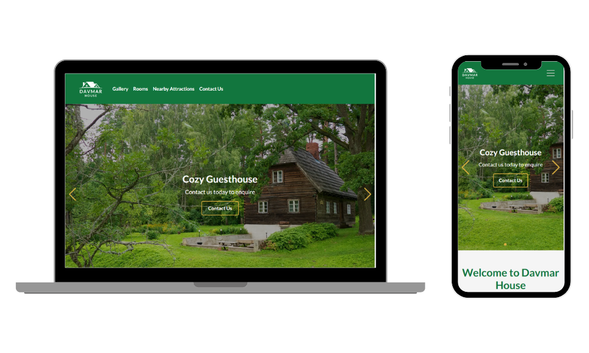
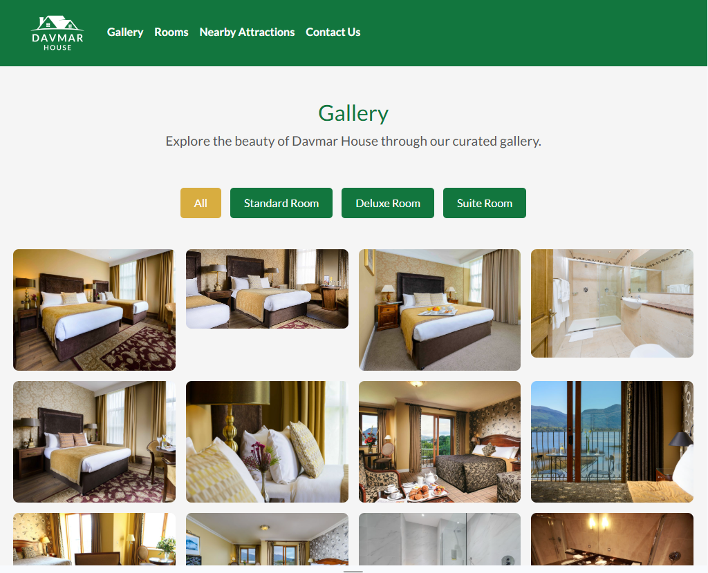
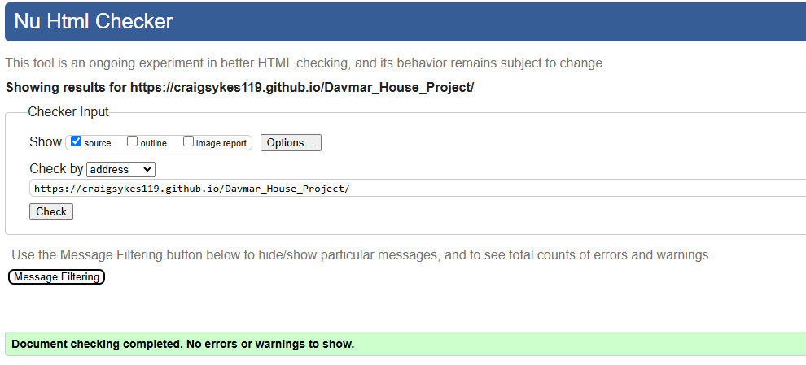
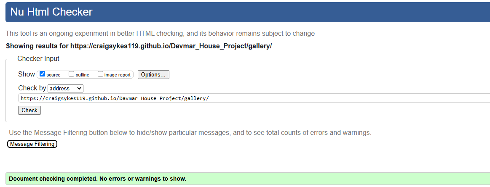
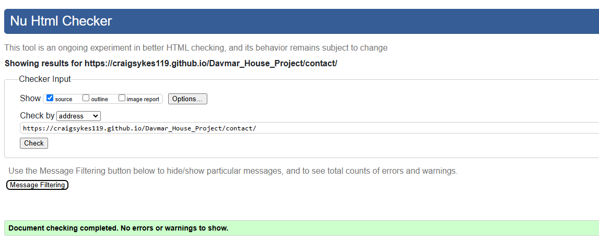
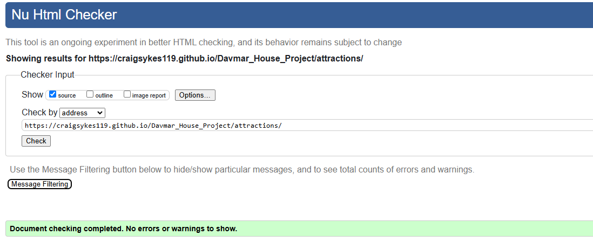
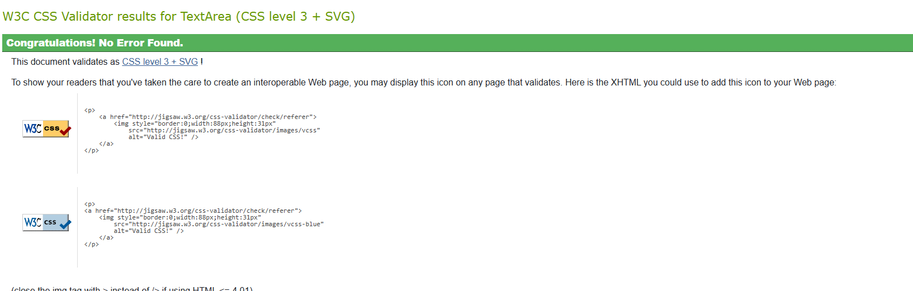

# Davmar House

The Davmar House website is designed to provide an engaging and informative online presence for a guesthouse located in Blarney, County Cork, Ireland. This website offers a seamless user experience, allowing visitors to explore the guesthouse, browse amenities, discover nearby attractions, and easily make contact for inquiries or bookings. View the live site [here](https://craigsykes119.github.io/Davmar_House_Project/).

 

GitHub Profile: <https://github.com/CraigSykes119>
Deployed Site: <https://craigsykes119.github.io/Davmar_House_Project/>

## Table of contents

- [Davmar House](#davmar-house)
  - [Table of contents](#table-of-contents)
  - [🏡 User Experience](#-user-experience)
    - [🎯 Goal of the Website](#-goal-of-the-website)
    - [🔑 Key Information for the Site](#-key-information-for-the-site)
  - [👤 User Stories](#-user-stories)
    - [**📌 General User Goals**](#-general-user-goals)
    - [**🆕 First-Time Users**](#-first-time-users)
    - [**🔄 Returning Visitor Goals**](#-returning-visitor-goals)
    - [**🔁 Frequent User Goals**](#-frequent-user-goals)
    - [**🔧 Site Owner Goals**](#-site-owner-goals)
    - [✅ **Why This Matters?**](#-why-this-matters)
  - [🎨 Design](#-design)
    - [🎨 Color Scheme](#-color-scheme)
    - [**🖋️ Branding \& Logo**](#️-branding--logo)
    - [🖼️ **Imagery**](#️-imagery)
    - [📐 **Wireframe \& Initial Design Planning**](#-wireframe--initial-design-planning)
    - [**✅ Why This Matters?**](#-why-this-matters-1)
  - [🌟 Features](#-features)
    - [🔖 Favicon](#-favicon)
    - [📌 **Navigation Bar**](#-navigation-bar)
    - [🔽 **Footer**](#-footer)
  - [🏠 **Homepage**](#-homepage)
    - [🎬 **Hero Section**](#-hero-section)
  - [🛏️ **Rooms \& Rates**](#️-rooms--rates)
  - [🖼️ **Gallery Page**](#️-gallery-page)
  - [📍 **Nearby Attractions**](#-nearby-attractions)
  - 
  - [🌦️ **Live Weather Widget**](#️-live-weather-widget)
  - [📞 **Contact Page**](#-contact-page)
  - [🚀 **Features to Implement in the Future**](#-features-to-implement-in-the-future)
    - [**✅ Why This Matters?**](#-why-this-matters-2)
  - [♿ Accessibility](#-accessibility)
    - [✅ **Semantic HTML Structure**](#-semantic-html-structure)
    - [🖼️ **Alternative Text for Images**](#️-alternative-text-for-images)
    - [🎤 **ARIA Attributes for Enhanced Accessibility**](#-aria-attributes-for-enhanced-accessibility)
    - [🎨 **Color Contrast \& Readability**](#-color-contrast--readability)
    - [📱 **Responsive \& Mobile-Friendly Design**](#-responsive--mobile-friendly-design)
  - [🛠️ Technology](#️-technology)
    - [**🖥️ Languages**](#️-languages)
    - [**📦 Frameworks, Libraries \& Tools**](#-frameworks-libraries--tools)
      - [Astro](#astro)
      - [Bootstrap](#bootstrap)
      - [Swiper.js](#swiperjs)
      - [Google Fonts](#google-fonts)
      - [Font Awesome](#font-awesome)
      - [Favicon.io](#faviconio)
      - [TinyPNG](#tinypng)
      - [OpenWeatherMap API](#openweathermap-api)
      - [Google Maps API](#google-maps-api)
      - [Git](#git)
      - [GitHub](#github)
      - [GitHub Pages](#github-pages)
      - [Lighthouse](#lighthouse)
      - [Am I Responsive](#am-i-responsive)
      - [Canva](#canva)
      - [ChatGPT](#chatgpt)
      - [VS Code](#vs-code)
      - [RGBA Color Picker](#rgba-color-picker)
  - [🚀 Deployment](#-deployment)
    - [**📌 Deployment to GitHub Pages (Using GitHub Actions)**](#-deployment-to-github-pages-using-github-actions)
    - [**🔄 How the Deployment Works (GitHub Actions)**](#-how-the-deployment-works-github-actions)
  - [**📥 Forking the Repository**](#-forking-the-repository)
    - [**Steps to Fork the Repository:**](#steps-to-fork-the-repository)
  - [**💻 Cloning the Repository Locally**](#-cloning-the-repository-locally)
  - [🧪 Testing](#-testing)
    - [**🌍 Cross-Browser Testing**](#-cross-browser-testing)
    - [**📱 Cross-Device Testing**](#-cross-device-testing)
  - [**🛠️ Manual Testing**](#️-manual-testing)
    - [✅ **Navigation**](#-navigation)
    - [✅ **Footer**](#-footer-1)
    - [✅ **Forms \& Interactive Elements**](#-forms--interactive-elements)
  - [**📜 Validator Testing**](#-validator-testing)
    - [✅ **HTML Validation**](#-html-validation)
    - [✅ **CSS Validation**](#-css-validation)
  - [**🚀 Lighthouse Testing (Performance \& SEO)**](#-lighthouse-testing-performance--seo)
  - [🛠️ Bugs \& Fixes](#️-bugs--fixes)
    - [**Bug 1 - API Keys Not Working on Deployed Site**](#bug-1---api-keys-not-working-on-deployed-site)
    - [**Bug 2 - Contact Form Not Displaying Success Message**](#bug-2---contact-form-not-displaying-success-message)
    - [**Bug 3 - Weather Widget Not Displaying**](#bug-3---weather-widget-not-displaying)
    - [**Bug 4 - Google Maps Not Showing**](#bug-4---google-maps-not-showing)
    - [**Bug 5 - Some Images Not Loading on GitHub Pages (404 Errors)**](#bug-5---some-images-not-loading-on-github-pages-404-errors)
    - [**Final Outcome**](#final-outcome)
  - [🎖️ Credits](#️-credits)
    - [**📸 Content**](#-content)

## 🏡 User Experience  

### 🎯 Goal of the Website  

The **Davmar House website** aims to provide a seamless and engaging experience for potential visitors seeking accommodation in **Blarney, County Cork, Ireland**. It is designed to:  

- Showcase **the guesthouse and its amenities**.  
- Highlight **local attractions** to enhance the visitor's experience.  
- Provide **an easy-to-use contact form** for inquiries.  
- Ensure **a fully responsive and accessible design** across devices.  

### 🔑 Key Information for the Site  

- What is **Davmar House** and why is it a great place to stay?  
- **Amenities & comforts** offered at the guesthouse.  
- **Nearby attractions & experiences** in Blarney and Cork.  
- **Weather updates** for trip planning.  
- **Contact form** for inquiries and bookings.  

---

## 👤 User Stories  

### **📌 General User Goals**  

- As a general user, I want to clearly understand **the purpose of the website**.  
- As a general user, I want to **navigate the website easily**.  
- As a general user, I want the website to **format properly on different devices**.  
- As a general user, I want **interactive features** to enhance my experience.  

---

### **🆕 First-Time Users**  

- As a first-time visitor, I want to quickly **learn about Davmar House and its offerings**.  
- As a first-time visitor, I want to see **high-quality images of the guesthouse and rooms**.  
- As a first-time visitor, I want to explore **local attractions** to plan my trip.  
- As a first-time visitor, I want to **check prices and availability** before booking.  

---

### **🔄 Returning Visitor Goals**  

- As a returning visitor, I want to **view updated availability & pricing**.  
- As a returning visitor, I want to **check for seasonal offers or promotions**.  
- As a returning visitor, I want to **read new guest reviews & testimonials**.  
- As a returning visitor, I want to **quickly re-access the contact page** for inquiries.  

---

### **🔁 Frequent User Goals**  

- As a frequent user, I want to **check real-time weather updates** before traveling.  
- As a frequent user, I want to easily **locate the guesthouse on Google Maps**.    
- As a frequent user, I want to **stay updated on any new features or upgrades** to the guesthouse.  

---

### **🔧 Site Owner Goals**  

- As the site owner, I want to **keep the website updated and accurate**.  
- As the site owner, I want the website to be **fully responsive and accessible**.  
- As the site owner, I want to ensure the website **performs well with optimized load times**.  
- As the site owner, I want to **troubleshoot and fix any bugs** that may arise.  
- As the site owner, I want to track **visitor engagement and feedback** to improve the site.  

---

### ✅ **Why This Matters?**  
By addressing these **user goals**, the Davmar House website ensures a **smooth, enjoyable, and informative experience**, ultimately leading to **higher engagement, better bookings, and increased visitor satisfaction**.  

---

## 🎨 Design  

### 🎨 Color Scheme  

The **Davmar House** website follows a **green and white** color scheme, reflecting the natural and welcoming ambiance of the guesthouse.  

- **Primary Color:** 🌿 **Green** `#12763e` (Symbolizing nature, relaxation, and warmth).  
- **Secondary Color:** ⚪ **White** `#ffffff` (Providing contrast, clarity, and a modern aesthetic).  
- **Accent Color:** ✨ **Gold** `#d4af37` (Used for CTAs, buttons, and highlights to add a touch of elegance).  

The **green background** reinforces the **serene and cozy atmosphere** of the guesthouse, while the **gold accent** aligns with its high-quality hospitality.  

  

---

### **🖋️ Branding & Logo**  

A custom logo was designed for **Davmar House** to establish a **strong brand identity**. The logo represents:  

- **A cozy, welcoming atmosphere** 🌿  
- **A professional yet homely touch** 🏡 
- **Easy recognition for guests** ⭐  

📌 **Davmar House Logo:**  
  

The logo is used consistently across the website, appearing in the **header, footer, and favicon**. It enhances the **site’s branding, credibility, and visual appeal**.

---

### 🖼️ **Imagery**  

The website makes **extensive use of high-quality imagery** to showcase **the guesthouse, its rooms, and the surrounding attractions**:  

- **Hero Section:** A **large, full-width background image** introduces visitors to Davmar House.  
- **Rooms & Rates:** High-resolution images depict **room styles**.  
- **Gallery:** A **filterable image grid** allows users to browse different rooms in detail of the guesthouse.  
- **Nearby Attractions:** Logos and images of **local places of interest** (e.g., Blarney Castle, restaurants, and pubs).  
- **Weather Widget & Maps:** **Icons and visuals** are used for better engagement.  

All images have been optimized for **performance and SEO (alt tags included)**.

---

### 📐 **Wireframe & Initial Design Planning**  

The design process started with **wireframing**, using **Canva**, to create **a structured layout** and identify the best user experience for:  

- **Homepage** (Hero image, introduction, and navigation structure).  
- **Gallery Page** (Image grid with interactive elements).  
- **Rooms & Rates** (Detailed listings with imagery and pricing).  
- **Nearby Attractions** (Map integration and business highlights).  
- **Contact Us** (A structured, easy-to-use form).  

While the final version evolved from the original wireframes, the **core layout and user flow remained consistent**.  

📌 **Wireframes:**  
- [Homepage Wireframe](read_me/wireframes/wireframe-home.png)  
- [Gallery Page Wireframe](read_me/wireframes/wireframe-gallery.png)  
- [Contact Page Wireframe](read_me/wireframes/wireframe-contact.png)  
- [Rooms Page Wireframe](read_me/wireframes/wireframe-rooms.png) 
- [Nearby Attractions Page Wireframe](read_me/wireframes/wireframe-nearby.png) 

---

### **✅ Why This Matters?**  
By combining **a strong visual identity, intuitive layout, and optimized images**, the Davmar House website delivers:  
- **Aesthetic appeal** 🎨 
- **Seamless navigation** 🧭  
- **Engaging and accessible content** 🏡 

The design choices **align with the guesthouse’s brand and customer expectations**, ensuring a welcoming **user experience** from the first visit.  

---

## 🌟 Features  

### 🔖 Favicon  

A **favicon** has been added to ensure the website has an **easily identifiable icon** in the browser tab, improving **brand recognition**.  

  

---

### 📌 **Navigation Bar**  

- The **responsive navigation bar** features the **Davmar House logo** on the left and anchor links on the right for easy access to key sections:  
  ✅ **Gallery**  
  ✅ **Rooms & Rates**  
  ✅ **Nearby Attractions**  
  ✅ **Contact Us**  
  

  

- A **hover effect** enhances usability by indicating **clickable elements**.  

  

- On **mobile screens (under 768px)**, the navigation menu **converts into a burger menu**, preserving the clean UI.  

  

- When tapped, the **burger menu expands**, allowing users to navigate easily before collapsing again.  

  

---

### 🔽 **Footer**  

- The footer includes:  
  ✅ A **copyright notice**.  
  ✅ A **quick menu** for ease of navigation.  
  ✅ **Social media icons** for Facebook, Instagram, Twitter (X), and YouTube, which are **fully interactive**.  

- These icons **act as a call to action**, encouraging users to explore **Davmar House’s online presence**.  

  

---

## 🏠 **Homepage**  

### 🎬 **Hero Section**  

- The **hero image** is the first interaction visitors have with the website. It:  
  ✅ **Showcases the guesthouse and surrounding nature.**  
  ✅ **Includes overlay text** to communicate the guesthouse’s welcoming atmosphere.  
  ✅ **Features a CTA button** to encourage users to contact us.  

- The **hero image is fully responsive**, ensuring it displays correctly on all screen sizes.  

  

---

## 🛏️ **Rooms & Rates**  

- The **Rooms & Rates page** provides:  
  ✅ A **detailed overview** of available rooms.  
  ✅ **Pricing information** and amenities included.  
  ✅ **Responsive design** for easy browsing on any device.  

---

## 🖼️ **Gallery Page**  

- The **interactive gallery** allows users to browse **images of Davmar House and its surroundings**.  
- The page features:  
  ✅ **A filterable grid** to view different areas of the guesthouse.  
  ✅ **High-quality images** optimized for performance.  

  

- The **fully responsive layout** ensures that images adapt to different screen sizes.  

  - [Gallery on mobile](read_me/media/gallery-mobile.PNG)  
  - [Gallery on tablet](read_me/media/gallery-tablet.PNG)  
  - [Gallery on laptop](read_me/media/gallery-laptop.PNG)  

---

## 📍 **Nearby Attractions**  

- This page highlights **top local attractions**, including:  
  ✅ Restaurants & pubs near Davmar House.  
  ✅ Cultural and historical landmarks, such as **Blarney Castle**.  
  ✅ Outdoor activities and places of interest.  

- Each attraction has:  
  ✅ A **high-resolution image or logo**.  
  ✅ A **brief description** of what visitors can expect.  
  ✅ **Links** for more details or navigation.  

---

## 🌦️ **Live Weather Widget**  

- The **live weather widget** integrates with the **OpenWeatherMap API** to:  
  ✅ Display **real-time weather updates** for Blarney.  
  ✅ Provide **temperature, wind and humidity**.  
  ✅ Enhance **trip planning** for visitors.  

  

---

## 📞 **Contact Page**  

- The **contact form** allows users to:  
  ✅ **Easily inquire** about room availability or general questions.  
  ✅ **Enter their name, email, and message**.  
  ✅ **Receive validation feedback** before submitting.  

- The **form is fully responsive** and adapts to different screen sizes.  

  - [Contact page on mobile](read_me/media/contact-me-mobile.PNG)  
  - [Contact page on tablet](read_me/media/contact-me-tablet.PNG)  
  - [Contact page on laptop](read_me/media/contact-me-laptop.PNG)  

---

## 🚀 **Features to Implement in the Future**  

Although this version of **Davmar House** is fully functional, future improvements may include:  

✅ **Online Booking System** – Allow users to book rooms directly from the website.  
✅ **Blog Section** – Share travel tips and recommendations for visiting Blarney.  
✅ **Newsletter Subscription** – Let users sign up for exclusive offers and updates.  
✅ **FAQ Section** – Address common questions about accommodation and services.  
✅ **Event Listings** – Display local events happening near Davmar House.  
✅ **Online Reviews** – Display reviews of past guests of Davmar House.  

---

### **✅ Why This Matters?**  

These features **enhance user experience, drive engagement, and improve functionality**, making **Davmar House a comprehensive and informative platform** for potential visitors.  

---

## ♿ Accessibility  

Ensuring **Davmar House** is **accessible to all users** is a key priority. The following features have been implemented to **enhance usability, readability, and navigation**:  

### ✅ **Semantic HTML Structure**  
- **Proper use of headings (`<h1>` to `<h6>`)** to create a **logical page hierarchy**.  
- **Landmark elements** (`<header>`, `<nav>`, `<main>`, `<footer>`) provide clear **structural meaning** to screen readers.  

### 🖼️ **Alternative Text for Images**  
- **All images include descriptive `alt` attributes** to provide context for visually impaired users.  
- **Gallery images** are accompanied by **meaningful captions** for additional clarity.  

### 🎤 **ARIA Attributes for Enhanced Accessibility**  
- **ARIA labels** are implemented for **social media icons** in the footer, allowing screen readers to interpret them correctly.  
- **Interactive elements** (buttons, forms, navigation links) are assigned **ARIA roles and labels** where necessary.  

### 🎨 **Color Contrast & Readability**  
- **Sufficient color contrast** has been maintained between text and background for **better readability**.  
- The **green (#12763e) and gold (#d4af37) accents** were chosen to be visually appealing while **complying with WCAG 2.1 contrast guidelines**.    

### 📱 **Responsive & Mobile-Friendly Design**  
- The website is fully **responsive**, adapting to different screen sizes and device orientations.  
- **Font sizes** and interactive elements maintain **usability on touch devices**.  

---

## 🛠️ Technology  

Throughout this project, the following technologies were used:  

---

### **🖥️ Languages**  

- **HTML** – Used for structuring content.  
- **CSS** – Used for styling and responsive design.  
- **JavaScript** – Used for interactive elements and API integrations.  

---

### **📦 Frameworks, Libraries & Tools**  

#### [Astro](https://astro.build/)  
- The **main framework** used for building the static website.  
- Provides **fast performance and modular components**.  

#### [Bootstrap](https://getbootstrap.com/)  
- Used for **responsive layout and styling**.  
- Includes **pre-built UI components** such as buttons, grids, and forms.  

#### [Swiper.js](https://swiperjs.com/)  
- Used for the **responsive hero image slider**.  
- Provides **smooth animations and touch support**.  

#### [Google Fonts](https://fonts.google.com/)  
- Used to incorporate **Lato and Roboto** fonts for typography.  

#### [Font Awesome](https://fontawesome.com/)  
- Used for **icons in the footer and navigation**.  

#### [Favicon.io](https://favicon.io/favicon-converter/)  
- Used to create **the favicon for browser tabs**.  

#### [TinyPNG](https://tinypng.com/)  
- Used to **compress images** and convert them to `.webp` format for better performance.  

#### [OpenWeatherMap API](https://openweathermap.org/api)  
- Used for the **live weather widget**.  
- Provides **real-time weather updates for Blarney**.  

#### [Google Maps API](https://developers.google.com/maps)  
- Used for **embedding an interactive map**.  
- Helps users find **Davmar House’s location** easily.  

#### [Git](https://git-scm.com/)  
- Used for **version control** and tracking changes.  
- **Command line terminal** used for committing and pushing updates.  

#### [GitHub](https://github.com/)  
- Used as a **repository** for storing and managing the project code.  
- GitHub Actions used for **continuous deployment** to GitHub Pages.  

#### [GitHub Pages](https://pages.github.com/)  
- Used for **deploying the website live**.  
- Ensures the site is **accessible from anywhere**.  

#### [Lighthouse](https://developers.google.com/web/tools/lighthouse)  
- Used for **testing site performance, SEO, and accessibility**.  
- Helped improve **page speed and best practices compliance**.  

#### [Am I Responsive](https://ui.dev/amiresponsive/)  
- Used to check **website responsiveness on different screen sizes**.  
- Helped ensure **mobile-friendliness**.  

#### [Canva](https://www.canva.com/)  
- Used to **design the logo and graphics**.  
- Provided **stock images for the homepage hero section**.  

#### [ChatGPT](https://chat.openai.com/)  
- Used for **reviewing text, improving grammar, and debugging code**.  

#### [VS Code](https://code.visualstudio.com/)  
- Used as the **primary code editor** for development.  
- Extensions such as **Prettier & ESLint** used for **code formatting**.  

#### [RGBA Color Picker](https://rgbacolorpicker.com/)  
- Used for **choosing and refining the color scheme**.  

---

## 🚀 Deployment  

The **Davmar House** website is deployed using **GitHub Pages** with **GitHub Actions for continuous deployment**. This ensures that every time changes are pushed to the repository, the website is automatically built and updated.

---

### **📌 Deployment to GitHub Pages (Using GitHub Actions)**  

The project is deployed to **GitHub Pages** via **GitHub Actions**, following these steps:  

1. Log in to **GitHub** and navigate to the **[Davmar House Repository](https://github.com/CraigSykes119/Davmar_House_Project)**.  
2. Click on the **Settings** tab in the repository.  
3. Scroll down to the **Pages** section (under "Code and Automation").  
4. Under **Branch**, select `"gh-pages"` from the dropdown.  
5. The page will refresh, and the deployed site will be available at:  
   **[https://CraigSykes119.github.io/Davmar_House_Project](https://CraigSykes119.github.io/Davmar_House_Project)**.  

### **🔄 How the Deployment Works (GitHub Actions)**  
- A **GitHub Actions workflow (`deploy.yml`)** handles the build and deployment process automatically.  
- Each time changes are pushed to the **main branch**, the site is rebuilt and deployed.  
- The action **compiles the Astro project and updates GitHub Pages** automatically.  

---

## **📥 Forking the Repository**  

By **forking** the repository, you create a **copy** of the project in your own GitHub account to experiment with or modify the project without affecting the original.  

### **Steps to Fork the Repository:**  
1. Log in to **GitHub** and navigate to the **[Davmar House Repository](https://github.com/CraigSykes119/Davmar_House_Project)**.  
2. Click the **"Fork"** button (top-right corner of the page).  
3. This creates a **duplicate repository** under your GitHub account.  
4. You can now **make changes independently** without modifying the original repository.  

---

## **💻 Cloning the Repository Locally**  

To work on the project locally, follow these steps to **clone** the repository:  

1. Log in to **GitHub** and navigate to the **[Davmar House Repository](https://github.com/CraigSykes119/Davmar_House_Project)**.  
2. Click on the **"Code"** button.  
3. Copy the **HTTPS clone link** (or use SSH if configured).  
4. Open **Git Bash / Terminal** and navigate to the folder where you want to store the project.  
5. Run the following command to clone the repository:  
   git clone https://github.com/CraigSykes119/Davmar_House_Project.git
6. Once cloned, navigate into the project directory: cd Davmar_House_Project
7. Install dependencies: npm install
8. Start the development server to preview the website locally: npm run dev

## 🧪 Testing  

The **Davmar House** website was thoroughly tested across multiple **browsers, devices, and validation tools** to ensure functionality, responsiveness, and performance.

---

### **🌍 Cross-Browser Testing**  
The site was tested successfully on the following **major web browsers**:  
- ✅ **Google Chrome**  
- ✅ **Microsoft Edge**  
- ✅ **Safari**  

✅ **Result:** No significant differences or layout issues detected across browsers.

---

### **📱 Cross-Device Testing**  
Using **Google Developer Tools** and real devices, the website was tested on various screen sizes:  

- 📱 **[Galaxy Z Fold 5](read_me/testing/test-galaxy-fold.PNG)**  
- 📱 **[iPad Air](read_me/testing/test-pad-air.PNG)**  
- 💻 **[My personal laptop](read_me/testing/test-personal-laptop.PNG)**  

✅ **Result:** The site remains **fully responsive**, with no broken layouts or misalignment issues.

---

## **🛠️ Manual Testing**  

The following **core functionalities** were manually tested:

### ✅ **Navigation**
- **Navbar links** correctly redirect users to the respective sections/pages.
- **Active page indicator** updates based on user location.
- **Burger menu functions correctly** on mobile devices.

### ✅ **Footer**
- **Social media icons** are interactive and open correct external links.
- **Footer content remains responsive** and does not overlap on small screens.

### ✅ **Forms & Interactive Elements**
- **Contact form**
  - Fields are required before submission.
  - Validation errors appear if incorrect input is provided.
  - Successful submission redirects correctly.

- **Weather Widget**
  - Retrieves and displays **real-time weather data** from OpenWeatherMap.
  - Correct **temperature and weather condition icons** appear.
  
- **Google Maps API**
  - Map loads and pins **Davmar House’s location** accurately.

✅ **Result:** All features work **as expected**, with no major issues.

---

## **📜 Validator Testing**  

### ✅ **HTML Validation**  
All pages have passed without errors through the [W3 HTML Validator](https://validator.w3.org/).  

 
 
 
  

### ✅ **CSS Validation**  
The CSS stylesheet passed **without errors** through the [W3 CSS Validator](https://jigsaw.w3.org/css-validator/).  

  

---

## **🚀 Lighthouse Testing (Performance & SEO)**  

The website was tested using **Google Lighthouse** for **performance, accessibility, and SEO optimization**.  

- **[Lighthouse test for Home page](read_me/testing/lighthouse-homepage.PNG)**  
- **[Lighthouse test for Gallery page](read_me/testing/lighthouse-gallery.PNG)**  
- **[Lighthouse test for Contact Me page](read_me/testing/lighthouse-contact-me.PNG)** 
- **[Lighthouse test for Rooms page](read_me/testing/lighthouse-rooms.PNG)**  
- **[Lighthouse test for Nearby Attractions page](read_me/testing/lighthouse-nearby.PNG)**  

--- 

## 🛠️ Bugs & Fixes

### **Bug 1 - API Keys Not Working on Deployed Site**
**Description:**  
- The Weather API and Google Maps API worked locally but **did not function after deployment** to GitHub Pages.  
- `import.meta.env.PUBLIC_WEATHER_API_KEY` was returning `undefined`.  

**Cause:**  
- `.env` files are **not included** in GitHub Pages deployments, requiring **GitHub Actions secrets** instead.  

**Solution:**  
- Stored API keys securely in **GitHub Secrets**.  
- Updated `deploy.yml` to pass environment variables correctly.  
- Used Astro’s `define` in `config.mjs` to inject API keys dynamically.  

✅ **Result:** API keys now load successfully on both local and deployed environments.

---

### **Bug 2 - Contact Form Not Displaying Success Message**
**Description:**  
- After submitting the contact form, **no success message appeared**.  
- The form submission did not provide feedback, leaving users uncertain if the message was sent.  

**Cause:**  
- Missing `event.preventDefault()` in the JavaScript handling the form submission.  
- The success message logic was **not triggering correctly** due to incorrect `display` CSS settings.  

**Solution:**  
- Ensured the form was submitting correctly with an event listener.  
- Added a hidden success message `
Your message has been sent!
`.  
- Updated the CSS to **correctly show the message** after form submission.  

✅ **Result:** Contact form now **displays a success message** upon submission.

---

### **Bug 3 - Weather Widget Not Displaying**
**Description:**  
- The Weather Widget component **was not fetching weather data** from OpenWeatherMap.  
- Console logs showed `401 Unauthorized`.  

**Cause:**  
- The API key was either **not properly loaded** from the environment or was **not passed correctly** in the fetch request.  

**Solution:**  
- Verified `import.meta.env.PUBLIC_WEATHER_API_KEY` was properly set.  
- Fixed the `fetch` URL structure to correctly include the API key.  
- Wrapped the `fetch` call inside an `async` function and added error handling.  

✅ **Result:** The Weather Widget **now fetches and displays live weather data**.

---

### **Bug 4 - Google Maps Not Showing**
**Description:**  
- The embedded Google Map **did not appear** on the **Contact Us** page.  
- The iframe `src` value was not being interpreted correctly in Astro.  

**Cause:**  
- The `src` attribute used `{googleMapsSrc}` which Astro did not properly evaluate.  

**Solution:**  
- Used **string interpolation** and ensured `src={googleMapsSrc}` was directly assigned.  
- Verified the API key was **properly loaded** from the `.env` file.  

✅ **Result:** Google Maps is now **displayed correctly** in the Contact section.

---

### **Bug 5 - Some Images Not Loading on GitHub Pages (404 Errors)**
**Description:**  
- Three images (`soba_logo.png`, `Tung_sing_logo.png`, `Costigans_logo.png`) **appeared correctly on local development** but **showed 404 errors after deployment**.  

**Cause:**  
- GitHub Pages **is case-sensitive**, but some image file names used different casing (`.PNG` vs `.png`).  
- Astro **compiles static assets differently** in production, requiring correct paths.  

**Solution:**  
- Standardized all file names to lowercase (`.png`).  
- Updated `` references in `AttractionsGrid.astro` to use the correct casing.  

✅ **Result:** All images **now display correctly** on both local and deployed environments.

---

### **Final Outcome**
All of these bugs were fixed, **improving site performance, usability, and accessibility**. 🚀🎉

## 🎖️ Credits 

### **📸 Content**
- **Images Used for the Gallery**  
  - [Lakes Hotel Killarney](https://www.lakehotelkillarney.ie/index.html)  
  - [All Other Images](https://www.canva.com/)  

**ICopy used for website**  
  - [Davmar House current website](https://davmar-blarney.com/)
